# TechNewsBoard — Architecture Documentation

> Generated from GitNexus knowledge graph: **823 symbols**, **1266 relationships**, **47 execution flows** across **8 functional clusters**.

## Overview

TechNewsBoard is a real-time tech news aggregation dashboard built with Next.js 16 App Router and React 19. It aggregates news from 20+ RSS feeds, Hacker News, GitHub Trending, AI blog scrapers, and Firecrawl — providing AI-powered chat interactions with articles.

**Tech Stack**: Next.js 16, React 19, Tailwind CSS v4, TypeScript (strict: false), ESM-only (`"type": "module"`)

**Key Characteristics**:
- All pages are `'use client'` — no React Server Components
- Local-first: all user state in browser `localStorage`
- Server-side aggregation via API routes to avoid CORS
- Multi-provider LLM chat (OpenAI, Claude, GitHub Models, Ollama, LM Studio, Custom)

---

## Functional Areas

The knowledge graph identifies 8 functional clusters via community detection (Leiden algorithm):

### 1. App — Main Dashboard (21 symbols, 3 files, 74% cohesion)

The core dashboard experience — news grid, filtering, bookmarks, auto-refresh, and settings.

| Key Symbol | File | Line |
|-----------|------|------|
| `Home` | `app/page.js` | 53 |
| `fetchNews` | `app/page.js` | 125 |
| `toggleCategory` | `app/page.js` | 168 |
| `toggleSource` | `app/page.js` | 187 |
| `toggleBookmark` | `app/page.js` | 207 |
| `isBookmarked` | `app/page.js` | 220 |
| `handleAskAbout` | `app/page.js` | 297 |
| `writeState` | `lib/state-manager.ts` | 29 |
| `showNotifications` | `lib/notification-store.ts` | 110 |

**Connected to**: Bookmarks (2 calls), Components (2 calls)

### 2. Components — UI Components (70 symbols, 13 files, 90% cohesion)

The largest cluster — all shared React components and data management utilities.

| Key Symbol | File |
|-----------|------|
| `ChatSidebar` | `app/components/ChatSidebar.js` |
| `FeedManager` | `app/components/FeedManager.js` |
| `ChatProviderSettings` | `app/components/ChatProviderSettings.js` |
| `NotificationSettings` | `app/components/NotificationSettings.js` |
| `DataImportExport` | `app/components/DataImportExport.js` |
| `loadFeeds` | `lib/feed-store.ts` |
| `importAllData` | `lib/import.ts` |
| `exportFeeds` | `lib/export.ts` |
| `buildNewsContext` | `lib/chat-providers.ts` |

**Connected to**: App (5 calls), Bookmarks (1 call)

### 3. Bookmarks — Saved Articles (12 symbols, 5 files, 74% cohesion)

Bookmark CRUD and persistence via `localStorage`.

| Key Symbol | File |
|-----------|------|
| `BookmarksPage` | `app/bookmarks/page.js` |
| `readBookmarks` / `writeBookmarks` | `lib/state-manager.ts` |
| `toggleBookmark` | `app/page.js` |
| `exportBookmarks` | `lib/export.ts` |

### 4. Chat — LLM Integration (8 symbols, 4 files, 93% cohesion)

Provider abstraction, chat proxy API, and rate limiting.

| Key Symbol | File |
|-----------|------|
| `POST` (chat handler) | `app/api/chat/route.ts` |
| `formatRequestBody` | `lib/chat-providers.ts` |
| `getChatUrl` | `lib/chat-providers.ts` |
| `parseStreamChunk` | `lib/chat-providers.ts` |
| `checkRateLimit` | `lib/rate-limiter.ts` |
| `POST` (auth handler) | `app/api/auth/github/route.ts` |

### 5. News — Aggregation Pipeline (6 symbols, 3 files, 78% cohesion)

API route + specialized blog scrapers.

| Key Symbol | File |
|-----------|------|
| `GET` (news handler) | `app/api/news/route.ts` |
| `fetchFeedWithFallback` | `lib/rss-parser.ts` |
| `fetchAnthropicResearch` | `lib/ai-blogs.ts` |
| `fetchKimiBlog` | `lib/ai-blogs.ts` |
| `fetchWithTimeout` | `lib/ai-blogs.ts` |

**Connected to**: Cluster_5 (RSS Parser), Cluster_14 (HN), Cluster_16 (GitHub Trending)

### 6. Cluster_5 — RSS Parser Core (5 symbols, 1 file, 80% cohesion)

Low-level RSS/Atom parsing with retry logic.

| Key Symbol | File |
|-----------|------|
| `stripCDATA` | `lib/rss-parser.ts` |
| `fetchWithTimeout` | `lib/rss-parser.ts` |
| `parseRSSXML` | `lib/rss-parser.ts` |
| `fetchRSSFeed` | `lib/rss-parser.ts` |
| `fetchWithRetry` | `lib/rss-parser.ts` |

### 7. Cluster_14 — Hacker News (4 symbols, 1 file, 86% cohesion)

HN Firebase API integration.

| Key Symbol | File |
|-----------|------|
| `fetchHackerNews` | `lib/hacker-news.ts` |
| `storyPromises` | `lib/hacker-news.ts` |

### 8. Cluster_16 — GitHub Trending (6 symbols, 1 file, 94% cohesion)

GitHub Trending page scraping with HTML regex parsing.

| Key Symbol | File |
|-----------|------|
| `fetchGitHubTrending` | `lib/github-trending.ts` |
| `extractLanguage` | `lib/github-trending.ts` |
| `getLanguageGradient` | `lib/github-trending.ts` |
| `fetchGitHubApiFallback` | `lib/github-trending.ts` |

---

## Key Execution Flows

Derived from knowledge graph process traces:

### Flow 1: News Fetching (`Home → LoadFeeds`, 4 steps)

```
Home (app/page.js:53)
    │
    ▼
fetchNews (app/page.js:125)
    │
    ▼
GET /api/news ──► Promise.all([
    │              ├── RSS Feeds (fetchFeedWithFallback)
    │              ├── Hacker News (fetchHackerNews)
    │              ├── GitHub Trending (fetchGitHubTrending)
    │              ├── AI Blogs (fetchAnthropicResearch, fetchKimiBlog)
    │              └── Firecrawl (fetchFirecrawl)
    │            ])
    │
    ▼
Server-side filter (categories, language, search, time range)
    │
    ▼
setNews(data) → render news grid
```

### Flow 2: AI Chat (`ChatSidebar → BuildSystemPrompt`, 3 steps)

```
ChatSidebar (app/components/ChatSidebar.js:89)
    │
    ▼
sendMessage (app/components/ChatSidebar.js:134)
    │ (builds messages: buildNewsContext + buildSystemPrompt)
    ▼
POST /api/chat { provider, messages }
    │
    ▼
chat/route.ts: formatRequestBody → getChatUrl → getHeaders
    │
    ▼
Upstream LLM provider (SSE stream)
    │
    ▼
TransformStream: parseStreamChunk → clean { text } SSE
    │
    ▼
ChatSidebar: reader → append to messages state → ReactMarkdown render
```

### Flow 3: Bookmarks (`BookmarksPage → IsBrowser`, 6 steps)

```
BookmarksPage (app/bookmarks/page.js:24)
    │
    ▼
removeBookmark / loadBookmarks / saveBookmarks
    │ (localStorage: technews-bookmarks)
    │
    ▼
readBookmarks / writeBookmarks (lib/state-manager.ts)
    │
    ▼
isBrowser guard → localStorage read/write
```

### Flow 4: Feed Management (`FeedManager → LoadFeeds` / `SaveFeeds`, 4 steps)

```
FeedManager (app/components/FeedManager.js:23)
    │
    ▼
handleToggleFeed / handleAddFeed / handleDeleteFeed
    │
    ▼
feed-store.ts: toggleFeed / addFeed / removeFeed
    │
    ▼
saveFeeds → localStorage (technews-feeds) → onFeedsChange → refetch
```

### Flow 5: Data Import/Export (`ConfirmImport → SaveBookmarks`, 3 steps)

```
confirmImport (app/components/DataImportExport.js)
    │
    ▼
importAllData (lib/import.ts:23)
    │
    ▼
saveBookmarks / saveSettings / saveFeeds → update localStorage
```

---

## Mermaid Architecture Diagram

```mermaid
graph TB
    subgraph Client["Browser (Client)"]
        UI["app/page.js<br/>Main Dashboard<br/>21 symbols"]
        Bmk["app/bookmarks/page.js<br/>Bookmarks<br/>12 symbols"]

        UI --> Chat["ChatSidebar.js<br/>Chat Panel"]
        UI --> FM["FeedManager.js<br/>Feed Manager"]
        UI --> NS["NotificationSettings.js<br/>Notifications"]
        UI --> DIE["DataImportExport.js<br/>Import/Export"]
        UI --> CPS["ChatProviderSettings.js<br/>Provider Config"]

        Chat --> CP["chat-providers.ts<br/>Provider Abstraction"]
        FM --> FS["feed-store.ts<br/>Feed Store"]
        UI --> NM["notification-store.ts<br/>Notification Store"]
        UI --> SM["state-manager.ts<br/>State Manager"]
        DIE --> IMP["import.ts / export.ts<br/>Data Portability"]
    end

    subgraph API["API Routes (Server)"]
        AN["/api/news<br/>GET"]
        AC["/api/chat<br/>POST"]
        AG["/api/auth/github<br/>POST/PUT"]
        RL["rate-limiter.ts<br/>In-memory"]
    end

    subgraph Sources["News Sources"]
        RSS["RSS Feeds<br/>20+ sources"]
        HN["Hacker News<br/>Firebase API"]
        GH["GitHub Trending<br/>HTML Scrape"]
        AB["AI Blogs<br/>Anthropic + Kimi"]
        FC["Firecrawl<br/>localhost:5002"]
    end

    subgraph LLM["LLM Providers"]
        OAI["OpenAI"]
        CLD["Anthropic/Claude"]
        GHM["GitHub Models"]
        OLA["Ollama"]
        LMS["LM Studio"]
        CST["Custom API"]
    end

    UI -->|"GET /api/news?feeds&days&category&q&lang"| AN
    AN -->|"Promise.all"| RSS
    AN -->|"fetchHackerNews"| HN
    AN -->|"fetchGitHubTrending"| GH
    AN -->|"fetchAnthropicResearch + fetchKimiBlog"| AB
    AN -->|"fetchFirecrawl"| FC
    AN --> RL
    RSS -->|"XML"| RP["rss-parser.ts<br/>parse + retry"]

    UI -->|"POST { provider, messages }"| AC
    AC --> RL
    AC -->|"SSE proxy"| OAI
    AC -->|"SSE proxy"| CLD
    AC -->|"SSE proxy"| GHM
    AC -->|"SSE proxy"| OLA
    AC -->|"SSE proxy"| LMS
    AC -->|"SSE proxy"| CST

    UI --> AG
    AG --> RL

    Bmk -->|"localStorage"| SM
    FS -->|"localStorage"| SM
    NM -->|"localStorage"| SM
    IMP -->|"localStorage"| SM

    style UI fill:#e1f5ff,stroke:#01579b,stroke-width:2px
    style AN fill:#f3e5f5,stroke:#4a148c,stroke-width:2px
    style AC fill:#f3e5f5,stroke:#4a148c,stroke-width:2px
    style RL fill:#fce4ec,stroke:#880e4f,stroke-width:2px
    style RSS fill:#fff3e0,stroke:#e65100
    style HN fill:#fff3e0,stroke:#e65100
    style GH fill:#fff3e0,stroke:#e65100
    style AB fill:#fff3e0,stroke:#e65100
    style FC fill:#fff3e0,stroke:#e65100
    style OAI fill:#fff8e1,stroke:#f57f17
    style CLD fill:#fff8e1,stroke:#f57f17
```



---

## Data Flow

```
┌─────────────────────────────────────────────────────────────────────┐
│                          Browser (Client)                           │
│                                                                      │
│  ┌──────────────────┐   ┌──────────────┐   ┌────────────────────┐  │
│  │  Home (page.js)  │   │  FeedManager │   │ NotificationStore  │  │
│  │  (Dashboard)     │   │  (Feeds UI)  │   │  (Keywords)        │  │
│  └────────┬─────────┘   └──────┬───────┘   └─────────┬──────────┘  │
│           │                    │                      │              │
│           ▼                    ▼                      ▼              │
│  ┌───────────────────────────────────────────────────────────────┐  │
│  │              localStorage (technews-*)                        │  │
│  │  bookmarks │ settings │ feeds │ notifications │ chat-history  │  │
│  └───────────────────────────────────────────────────────────────┘  │
│                               │                                      │
│           ┌───────────────────┼───────────────────┐                  │
│           ▼                   ▼                   ▼                  │
│  ┌────────────────┐ ┌────────────────┐ ┌────────────────────────┐   │
│  │  /api/news     │ │  /api/chat     │ │  /api/auth/github      │   │
│  │  (GET)         │ │  (POST)        │ │  (POST/PUT)            │   │
│  └────────┬───────┘ └────────┬───────┘ └──────────┬─────────────┘   │
└───────────┼──────────────────┼────────────────────┼─────────────────┘
            │                  │                    │
            ▼                  ▼                    ▼
      ┌────────────┐   ┌─────────────────┐     GitHub OAuth
      │ RSS Feeds  │   │ LLM Providers   │
      │ HN Firebase│   │ OpenAI          │
      │ GH Trending│   │ Claude          │
      │ AI Blogs   │   │ GitHub Models   │
      │ Firecrawl  │   │ Ollama/LMStudio │
      └──────┬─────┘   │ Custom API      │
             │         └─────────────────┘
             ▼
      ParsedNewsItem[]
```

---

## Key Design Decisions

1. **Client-only architecture**: All pages are `'use client'` — no React Server Components. State is managed entirely in-browser via React hooks.

2. **Server-side aggregation**: The `/api/news` endpoint fetches from all sources in parallel on the server to avoid CORS issues and reduce client bandwidth.

3. **Unified data model**: All sources normalize to `ParsedNewsItem` regardless of origin (RSS, HN, GitHub, AI blogs, Firecrawl).

4. **Resilient feed fetching**: RSS parser retries with exponential backoff and falls back to alternate URLs if configured.

5. **Multi-provider chat**: `chat-providers.ts` abstracts OpenAI and Anthropic API differences, enabling the same UI to work with any compatible provider (6 presets).

6. **Local-first persistence**: All user data (feeds, settings, bookmarks, chat history, notifications) lives in browser `localStorage` — no backend database required.

7. **Data portability**: Full import/export/reset functionality (`lib/import.ts`, `lib/export.ts`) allows users to backup and migrate their configuration.

8. **In-memory rate limiting**: `lib/rate-limiter.ts` uses sliding window per-route limits to prevent upstream overload (5 req/min for news, 10 for chat, 3 for auth).

9. **AI blog dual sourcing**: AI blog content comes from both direct HTML scraping (`ai-blogs.ts`) and Firecrawl-powered scraping (`firecrawl.ts`) for redundancy.

10. **Chinese language support**: ~6 Traditional Chinese feeds (HK/TW) with language filtering in both UI and API.
