# TechNewsBoard Architecture

> Architecture overview for the TechNewsBoard tech news dashboard application.

## Overview

TechNewsBoard is a Next.js 16 (App Router) single-page application that aggregates tech news from multiple sources, provides an AI-powered chat interface for article analysis, and supports rich user interactions including bookmarks, article comparison, and real-time notifications.

The application features a unique "Phantom Dome" spherical news wall — a full-bleed 3D curved display where every news card is placed on the inside surface of a sphere using lat/long rotation, with drag-to-spin momentum and inertia.

### Technology Stack

- **Framework**: Next.js 16 with App Router
- **Frontend**: React 19, Tailwind CSS v4, Lucide icons, react-markdown
- **Language**: TypeScript (strict: false), ESM-only (`"type": "module"`)
- **Build Tool**: Next.js CLI (next dev --webpack / next build)
- **Test Runner**: Vitest
- **Fonts**: Geist (sans) + Geist Mono
- **Path Alias**: `@/*` → `./*`

---

## Functional Areas

### 1. Data Aggregation (Backend)

**Purpose**: Fetch and normalize articles from multiple external sources.

| Module | Responsibility |
|--------|--------------|
| `lib/news-sources.ts` | Defines RSS feed catalog with categories and fallback URLs; 22 default sources across 6 categories |
| `lib/rss-parser.ts` | Fetches RSS/Atom feeds with retry logic and fallback URL support; parses XML via regex and maps to `ParsedNewsItem[]` |
| `lib/hacker-news.ts` | Fetches top 15 stories from Hacker News Firebase API |
| `lib/github-trending.ts` | Scrapes GitHub Trending (TypeScript) HTML via regex to extract trending repos |
| `lib/feed-store.ts` | Client-side localStorage CRUD for user-configurable feed sources (enable/disable, add custom feeds) |

**Data Shape** — `ParsedNewsItem`: `{ title, link, description, image, pubDate, category, source, language?, gradientClass? }`

**Categories**: Startups, Consumer Tech, AI, Innovation, Open Source

### 2. API Layer (Backend)

**Purpose**: Serve aggregated data and proxy AI chat requests.

| Module | Responsibility |
|--------|--------------|
| `app/api/news/route.ts` | Aggregates all sources via `Promise.all()`, applies server-side filtering (time, category, search query, language) |
| `app/api/chat/route.ts` | Proxies streaming chat requests to various AI providers; SSE TransformStream parsing |
| `app/api/auth/github/route.ts` | GitHub OAuth Device Flow for GitHub Models authentication |

### 3. Dashboard UI (Frontend)

**Purpose**: Main news browsing, filtering, and reading experience.

| Module | Responsibility |
|--------|--------------|
| `app/page.js` | Main dashboard: news feed, category/time/language filters, search, bookmarks, auto-refresh, top stories grid |
| `app/bookmarks/page.js` | Bookmarked articles page with localStorage persistence |
| `app/layout.js` | Root layout with Geist font, SEO metadata, skip-to-content link |

### 4. Chat/AI System (Frontend)

**Purpose**: AI-powered article analysis and Q&A.

| Module | Responsibility |
|--------|--------------|
| `app/components/ChatSidebar.js` | Chat sidebar with streaming UI, message history (localStorage), quick prompts, article focus/compare |
| `lib/chat-providers.ts` | Provider abstraction for OpenAI, Claude, GitHub, Ollama, LM Studio, Custom APIs; request building and SSE parsing |
| `app/components/ChatProviderSettings.js` | Configure chat provider endpoints, models, and authentication |

**Provider Types**: openai, claude, github, ollama, lmstudio, custom

### 5. Feed Management (Frontend)

**Purpose**: User-configurable RSS source management.

| Module | Responsibility |
|--------|--------------|
| `app/components/FeedManager.js` | Add/edit/test/toggle RSS feeds; organize by language and category |

### 6. Notifications (Frontend)

**Purpose**: Browser notifications for keyword-matched articles.

| Module | Responsibility |
|--------|--------------|
| `lib/notification-store.ts` | Keyword-based article matching per category; browser notification dispatch |
| `app/components/NotificationSettings.js` | Toggle notifications, configure per-category keywords |

### 7. Data Import/Export (Frontend)

**Purpose**: Backup and restore user data.

| Module | Responsibility |
|--------|--------------|
| `lib/export.ts` | Export bookmarks, settings, feeds, and chat provider config to JSON |
| `lib/import.ts` | Import JSON data with merge/replace strategies, deduplication |
| `app/components/DataImportExport.js` | UI for import/export with preview and confirmation |

### 8. 3D News Wall (Frontend)

**Purpose**: Spherical "video wall" display for news cards.

| Module | Responsibility |
|--------|--------------|
| `app/components/PhantomDome.jsx` | Full-bleed spherical news wall using lat/long rotation; drag-to-spin with momentum/inertia; progressive reveal on scroll |

---

## Key Execution Flows

### Flow 1: News Refresh Pipeline

```
User clicks Refresh or Auto-refresh triggers
  ↓
app/page.js: fetchNews()
  ↓
GET /api/news?days=...&category=...&q=...&feeds=...&lang=...
  ↓
→ Promise.all() parallel fetch:
    - fetchFeedWithFallback() for each enabled RSS source
    - fetchHackerNews() for HN top stories
    - fetchGitHubTrending() for trending TypeScript repos
  ↓
Apply server-side filters (days, category, search, language)
  ↓
Return JSON → React state update → Dashboard re-renders
```

### Flow 2: Article AI Chat Flow

```
User clicks "Ask about this article" / selects comparison / types query
  ↓
ChatSidebar.js: buildNewsContext(articles) + buildSystemPrompt()
  ↓
POST /api/chat { provider, messages }
  ↓
chat-providers.ts: getChatUrl() + getHeaders() + formatRequestBody()
  ↓
Upstream AI provider (streaming SSE)
  ↓
/api/chat/route.ts: TransformStream parses SSE and forwards clean chunks
  ↓
ChatSidebar.js: Incrementally renders assistant response in real-time
```

### Flow 3: Bookmark Save/Restore

```
User clicks bookmark icon on article
  ↓
page.js: toggleBookmark() → bookmarks state update
  ↓
localStorage.setItem('technews-bookmarks', JSON.stringify(bookmarks))
  ↓
/bookmarks page reads from localStorage on mount and displays
```

### Flow 4: Notification Check

```
After each news fetch
  ↓
page.js: NotificationStore.checkArticleMatches(data)
  ↓
notification-store.ts: Match article titles/descriptions against category keywords
  ↓
If matches found and browser permission granted → showNotification()
```

### Flow 5: Feed Management

```
User opens Settings → Manage Feeds
  ↓
FeedManager.js fetches feed list from localStorage via feed-store.ts
  ↓
Enable/disable, add, or delete feeds → saveFeeds() to localStorage
  ↓
Next news refresh respects enabled sources (passed as ?feeds query param)
```

### Flow 6: 3D News Wall Interaction

```
PhantomDome renders items on spherical surface
  ↓
User drags/scrolls to spin the sphere
  ↓
Pointer events update rotY/rotX (longitude/latitude rotation)
  ↓
Inertia loop (requestAnimationFrame) applies friction and momentum
  ↓
When approaching right edge → onNearRightEdge callback triggers
  ↓
page.js: Progressive reveal — loads next batch of cards
```

---

## Architecture Diagram

```mermaid
flowchart TB
    subgraph External["External APIs"]
        TECH["techcrunch.com (RSS)"]
        HN["news.ycombinator.com"]
        GH["github.com/trending"]
        AI["OpenAI / Claude / etc."]
        OLLAMA["Ollama (localhost:11434)"]
        LMSTUDIO["LM Studio (localhost:1234)"]
    end

    subgraph NextJS_API["Next.js API Routes"]
        NEWS_API["/api/news ✦"]
        CHAT_API["/api/chat ✦"]
        AUTH_API["/api/auth/github ✦"]
    end

    subgraph DataLib["Data Libs"]
        RSS["📄 rss-parser.ts"]
        HN_LIB["📄 hacker-news.ts"]
        GH_LIB["📄 github-trending.ts"]
        SRC["📄 news-sources.ts"]
        FEED_STORE["📄 feed-store.ts"]
    end

    subgraph UIPages["Dashboard UI"]
        PAGE["🖥️ app/page.js"]
        BK_PAGE["🔖 app/bookmarks/page.js"]
        LAYOUT["📐 app/layout.js"]
    end

    subgraph Components["Components"]
        PHANTOM["🌐 PhantomDome.jsx"]
        CHAT["💬 ChatSidebar.js"]
        PROV["⚙️ ChatProviderSettings.js"]
        FEED["🗂️ FeedManager.js"]
        NOTIF["🔔 NotificationSettings.js"]
        IO["📥📤 DataImportExport.js"]
    end

    subgraph StateStores["State & Storage"]
        NOTIF_STORE["💾 notification-store.ts"]
        CHAT_PROV["💾 chat-providers.ts"]
        EXP_LIB["💾 export.ts"]
        IMP_LIB["💾 import.ts"]
        LS["🗄️ localStorage"]
    end

    %% Data flow
    TECH --> RSS
    HN --> HN_LIB
    GH --> GH_LIB
    SRC --> RSS

    RSS --> NEWS_API
    HN_LIB --> NEWS_API
    GH_LIB --> NEWS_API
    NEWS_API --> PAGE

    PAGE --> PHANTOM
    PHANTOM -->|onNearRightEdge| PAGE

    PAGE --> CHAT
    CHAT -->|POST messages| CHAT_API
    CHAT_API --> AI
    CHAT_API --> OLLAMA
    CHAT_API --> LMSTUDIO
    AI --> CHAT_API
    CHAT_API --> CHAT

    CHAT -->|buildSystemPrompt| CHAT_PROV
    CHAT -->|buildNewsContext| CHAT_PROV

    PAGE --> FEED
    FEED -->|read/write| FEED_STORE
    FEED_STORE --> LS

    PAGE --> NOTIF
    NOTIF -->|read/write| NOTIF_STORE
    NOTIF_STORE --> LS

    PAGE --> IO
    IO --> EXP_LIB
    IO --> IMP_LIB
    EXP_LIB --> LS
    IMP_LIB --> LS

    PROV -->|configure| CHAT_PROV
    CHAT_PROV --> LS

    PAGE --> BK_PAGE
    LAYOUT --> PAGE
    LAYOUT --> BK_PAGE

    AUTH_API -->|device flow| AI
    AUTH_API --> LS
```



---

## Data Flow Summary

```
                    ┌─────────────────────────────────────────────┐
                    │           External Data Sources                │
                    │  RSS Feeds  │  HN API  │  GitHub Trending   │
                    └─────────────┴──────────┴─────────────────────┘
                                    │
                                    ▼
                    ┌─────────────────────────────────────────────┐
                    │         Next.js API Routes                   │
                    │  /api/news (aggregate + filter)              │
                    │  /api/chat (proxy + stream)                  │
                    └─────────────────────────────────────────────┘
                                    │
                                    ▼
                    ┌─────────────────────────────────────────────┐
                    │            Client-Side State                     │
                    │  • filter state (category, days, search, lang) │
                    │  • bookmarks (localStorage)                     │
                    │  • feed settings (localStorage)                 │
                    │  • notification keywords (localStorage)         │
                    │  • chat provider config (localStorage)          │
                    │  • chat history (localStorage)                  │
                    └─────────────────────────────────────────────┘
                                    │
                                    ▼
                    ┌─────────────────────────────────────────────┐
                    │              UI Components                       │
                    │  page.js  │  PhantomDome  │  ChatSidebar      │
                    │  FeedManager  │  Settings Panels               │
                    └─────────────────────────────────────────────┘
```

---

## Project Structure

```
TechNewsBoard/
├── app/
│   ├── page.js                     # Main dashboard (news feed, filters, bookmarks)
│   ├── bookmarks/page.js           # Bookmark management view
│   ├── layout.js                   # Root layout with fonts + metadata
│   ├── globals.css                 # Global styles, Tailwind v4 import
│   ├── api/
│   │   ├── news/route.ts           # Aggregate news from all sources
│   │   ├── news/route.test.ts      # API route tests
│   │   ├── chat/route.ts           # Proxy chat to AI providers (streaming)
│   │   └── auth/github/route.ts    # GitHub OAuth device flow
│   └── components/
│       ├── PhantomDome.jsx         # 3D spherical news wall (lat/long rotation)
│       ├── ChatSidebar.js          # Chat UI (streaming, history, pills)
│       ├── ChatProviderSettings.js # AI provider config panel
│       ├── FeedManager.js          # Add/edit/enable/disable RSS feeds
│       ├── NotificationSettings.js # Keyword notification setup
│       └── DataImportExport.js     # Backup/restore UI + import preview
├── lib/
│   ├── rss-parser.ts               # RSS/Atom XML fetch + parse + fallbacks
│   ├── news-sources.ts             # Default RSS feed catalog + categories
│   ├── hacker-news.ts              # HN Firebase API top stories
│   ├── github-trending.ts          # GitHub Trending HTML scraper
│   ├── feed-store.ts               # localStorage CRUD for user feeds
│   ├── chat-providers.ts           # AI provider abstraction + prompts
│   ├── notification-store.ts       # Keyword matching + browser notifs
│   ├── export.ts                   # Export bookmarks/settings/feeds JSON
│   ├── import.ts                   # Import JSON with merge/replace logic
│   └── utils.ts                    # Shared utilities
├── package.json                    # Next.js 16, React 19, Tailwind v4
├── tsconfig.json                   # Path alias @/* → ./*
├── next.config.js                  # Next.js configuration
├── tailwind.config.js              # Tailwind configuration
├── postcss.config.mjs             # PostCSS with Tailwind plugin
├── vitest.config.ts                # Test configuration
└── AGENTS.md                       # Development guidelines
```

---

## Key Conventions

- All pages are `'use client'` — no server components are used.
- Dark mode is toggled via `document.documentElement.classList.add/remove('dark')`.
- All client-side persistence uses `localStorage` (no server-side database).
- The `ParsedNewsItem` interface is the universal article shape across all sources.
- RSS sources have **fallback URLs** for resilience; some (BBC, MIT Tech Review) do not.
- Chat supports **SSE streaming** and multiple AI providers with a unified format.
- Auto-refresh interval default: **30 minutes** (configurable via settings).
- Progressive reveal: max 300 cards visible, loaded in batches of 18 on scroll.
- GitHub Trending parser uses regex on HTML — fragile if GitHub changes markup.
- Chat history is capped at 50 messages to avoid localStorage quota errors.
